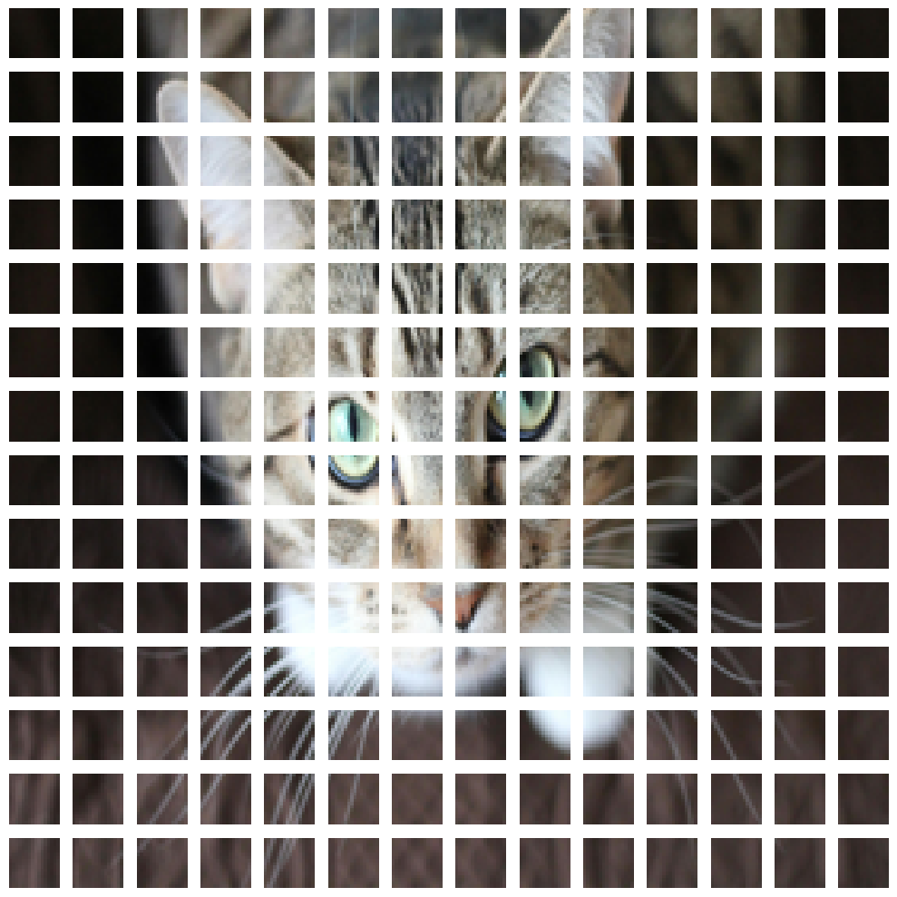

# Vision Transformer 
This project explores and reimplements the model architecture proposed in the seminal deep learning paper "An Image is Worth 16x16 Words: Transformers for Image Recognition at Scale"

## Project Structure
- **`vision_transfomer.ipynb`**: The main notebook, containing detailed reimplementation of the paper.

- **`ViT_training.ipynb`**: An experiment in pre-training the ViT model from scratch on the Oxford flowers 102 dataset

- **`Secondary files:`**:
    - **`model.py:`**: Only the code for the model developed in the main notebook.
    - **`experiment.py:`**: The experiment class implementing a basic training loop and tracking metrics
    - **`helper_functions.py:`**: Helper functions for the project
    - **`attention.ipynb:`**: An implementation of single head attention in NumPy in the context ot ViT
    - **`layer_norm.ipynb:`**: Explores the layer norm layer in more detail with some examples
    - **`oxford_flowers_mean_std.ipynb:`**: Calculates the mean and the standard deviation for the Oxford flowers 102 dataset

  

### Paper and Repo References:

#### Papers:
<input type="checkbox" disabled> [An Image is Worth 16x16 Words: Transformers for Image Recognition at Scale](https://arxiv.org/abs/2010.11929)  
<input type="checkbox" disabled> [Attention Is All You Need](https://arxiv.org/abs/1706.03762) 
<input type="checkbox" disabled> [BERT: Pre-training of Deep Bidirectional Transformers for Language Understanding](https://arxiv.org/abs/1810.04805)

#### I found these repos useful:
- &nbsp; [pytorch-deep-learning](https://github.com/mrdbourke/pytorch-deep-learning)
- &nbsp; [annotated_deep_learning_paper_implementations](https://github.com/labmlai/annotated_deep_learning_paper_implementations)

